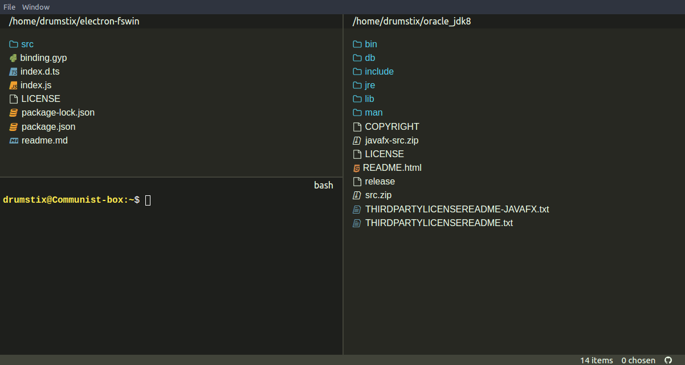

# FreeMAN

A free, extensible, cross-platform file manager for power users

---

## Features

* Quick, clean, dual-paned file-system navigation with a strong keyboard-led
    focus
* Integrated terminal per navigation pane for those things a file explorer just
    can't do
* Focus on customisability to tailor it to the user's whims
* Quick navigation with a *Go To* box

### Future

* Tighter integration between navigation and integrated terminals
* Further behaviour to be customisable
* Extending usefulness of the *Go To* and *Commands* boxes

## Roadmap

* Core application ready for beta use
* Out-of-the-box plugins ready for beta use
* Core application ready for production use
* Out-of-the-box plugins ready for production use

The core application is ready for beta use, supporting Linux and Windows OS's. Feel free to set up
`electron-builder` for MacOS and make a PR.

## Getting started

    npm install
    npm start

If you want, you can add user-specific settings files, e.g. `freeman.keys.json`
like so:

    touch {userData}/freeman.keys.json

`{userData}` above refers to Electron's `app.getPath("userData")` location, *(which
depends on whether the application is running in a development or production
environment)*. Example files can be found in the `./resources/` folder.

## Packaging

If you would like to package / install the program, on Windows and Linux you can:

    npm run package

Then run the appropriate built executable.

## Running

During development, after compiling you can:

    npm run start

After packaging, you can run the system-dependent executable outputted by
`electron-builder` in the `./dist/` folder.

## Debugging

Providing the `--verbose` command-line argument will make the application log
in more detail, helping trace execution when using the packaged app. Logs of
warnings and errors can be found at `{appData}/log.log`.

## How to contribute

Contributions are welcome! Work on the core application is still under way. There are
numerous areas with room for improvement in usability and stability. My
priorities for development are currently:

* Core functionality
* Plugin functionality (starting with out-of-the-box ones)
* Appearance

I'll take whatever pull requests, issues, contributors and PMs I can get! Please
have a look at the [Contributing Guidelines](./github/CONTRIBUTING.md) before
submitting a PR.
